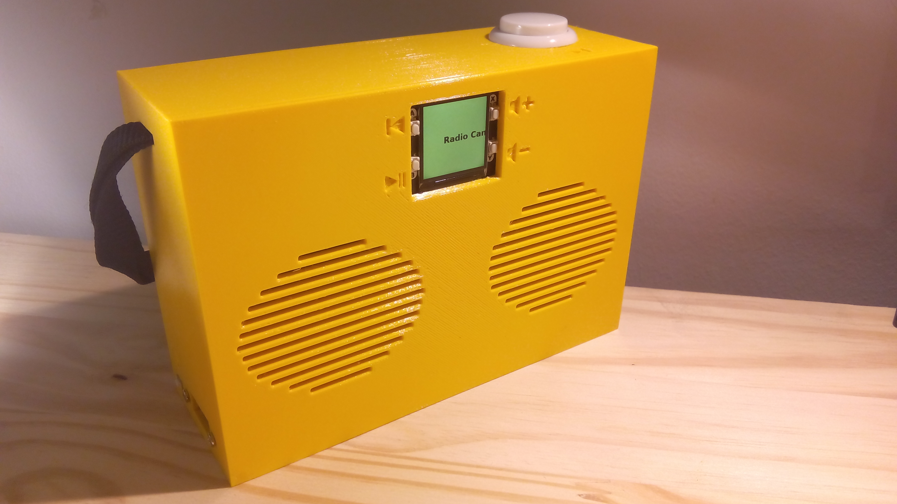
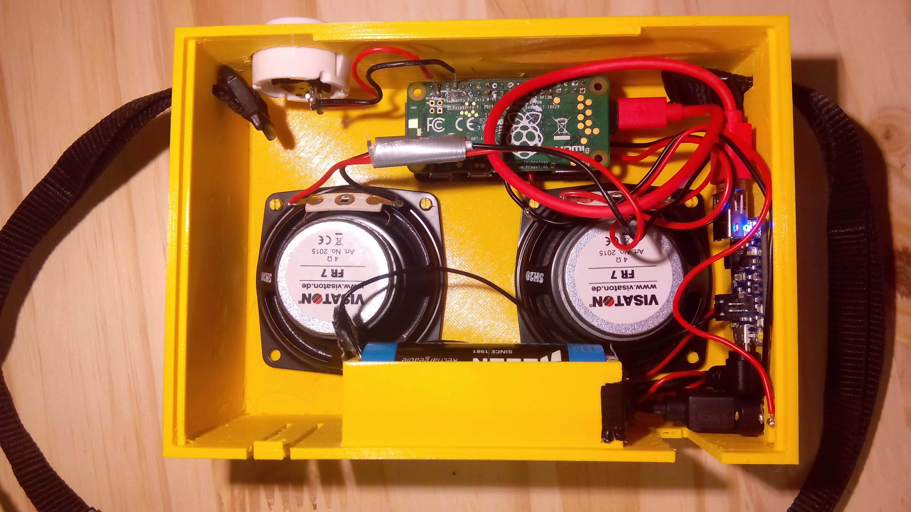
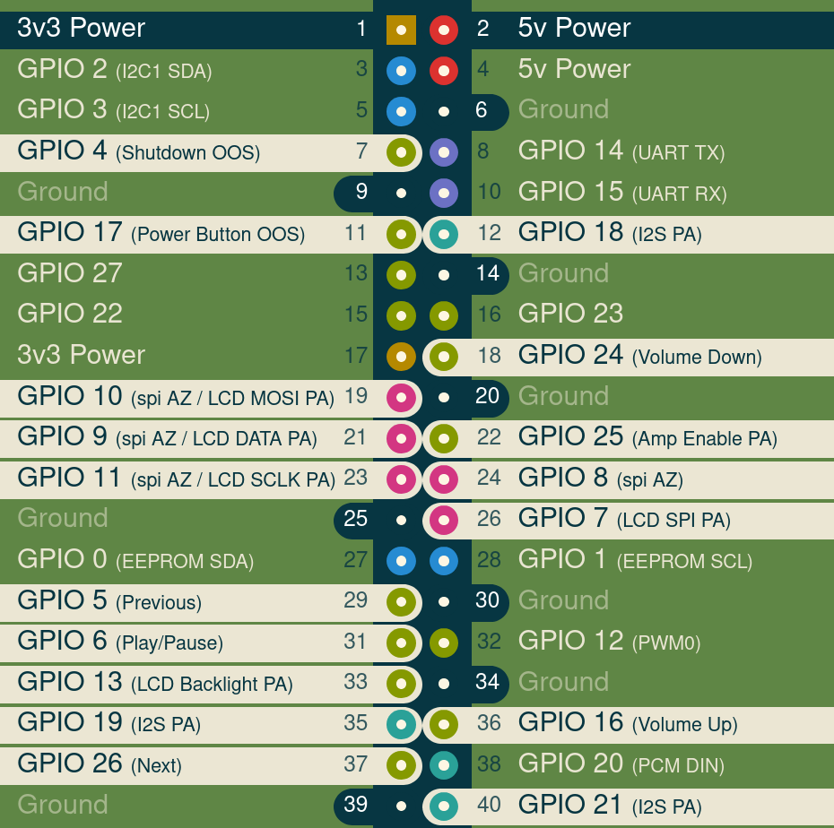
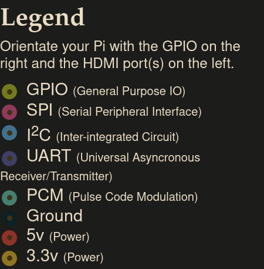

# Transistor

Build your own radio set and listen to **web radios**.  

  

All you need to do is copy [the image](https://github.com/pirateradiohack/Transistor/releases/latest) to a micro SD card and insert it in the following hardware:

- [Raspberry Pi Zero W 2](https://shop.pimoroni.com/products/raspberry-pi-zero-2-w?variant=39493046075475)
- Micro SD card (4GB should be enough if you don't want to store anything on it. If you want to store music or podcasts on your device then the bigger the better.)
- [Pirate Audio 3W Stereo Amp](https://shop.pimoroni.com/products/pirate-audio-3w-stereo-amp)
- A pair of [5W 4 Ohm 65mm Full Range Speaker](https://shop.pimoroni.com/products/5w-4-ohm-65mm-full-range-speaker)
- [On / Off switch](https://shop.pimoroni.com/products/onoff-shim)
- [Colourful Arcade Buttons](https://shop.pimoroni.com/products/colourful-arcade-buttons?variant=3030992879626) (For the Big Next Button(TM) )
- [Tactile Switch Buttons](https://shop.pimoroni.com/products/tactile-switch-buttons-6mm-slim-x-20-pack?variant=31479866785875) (For the power button)
- [USB A to microB cable - Red – 10cm](https://shop.pimoroni.com/products/usb-a-to-microb-cable-red?variant=32065140554) (To connect the On / Off switch power micro USB to the battery charger.)
- [Adafruit PowerBoost 1000 Charger - Rechargeable 5V Lipo USB Boost @ 1A - 1000C](https://shop.pimoroni.com/products/powerboost-1000-charger-rechargeable-5v-lipo-usb-boost-1a-1000c)
- [LiPo Battery Pack – 2000mAh](https://shop.pimoroni.com/products/lipo-battery-pack?variant=20429082247) (more mAh means more autonomy, bigger is better but also more expensive)
- [Right-angle Panel Mount Extension Cables (25cm) – USB micro-B](https://shop.pimoroni.com/products/right-angle-panel-mount-extension-cables-25cm?variant=32013609631827) (To connect to the battery charger and provide a power plug that goes outside the radio.)
- [optional] [RasPiO Analog Zero](https://shop.pimoroni.com/products/raspio-analog-zero) (Optional. If you plug it, you will be able to use an old radio volume knob out of the box!)

(if you find better hardware parts please [tell me](https://github.com/pirateradiohack/Transistor/issues/new/choose)!)

Get the components, assemble them together and build the case with a 3D printer:

- [Case](https://github.com/pirateradiohack/Transistor/blob/master/Transistor5.stl)  
- [Back Cover](https://github.com/pirateradiohack/Transistor/blob/master/Transistor5-cover.stl)

(You will need to adapt the battery compartment to fit you own battery.)

Alternatively you could use your own case, or an old radio, or a cardboard box, or a wooden box, or a toaster...

## Quick Setup

- Download the [latest image](https://github.com/pirateradiohack/Transistor/releases/latest), that's the ZIP file named image. Unzip it.
- Flash the image on a SD card with [etcher](https://www.balena.io/etcher/).
- On the SD carc copy the file named `bootstrap-transistor.txt` to `bootstrap.txt` and fill in your wifi details.
- Install the SD card in your radio and turn it on. (note that the first boot takes some time, be patient)
- Connect to the web interface: hold the play / pause button and you will see the IP address of the Transistor appear on its screen. Open that IP in your browser.
- From the interface, go to `browse` -> `webradios` -> `browse radio-browser.info`. There you can search for your radios and add them to favorites.
- Enjoy.

## Images:

Inside:  

## How it is built
The project is based on [myMPDos](https://github.com/jcorporation/myMPDos) which bring an Alpine Linux that works on the Raspberry Pi, along with
MPD and a web interface to control MPD. This version simply adds the necessary configuration to work with the Transistor hardware.

## Hardware
This is the detailed usage of the pins (thanks to https://pinout.xyz). This is mostly of interest when you want to connect the buttons.

OOS: On Off Shim  
AZ: Raspio Analog Zero  
PA: Pirate Audio Amp + LCD

Powers and grounds don't appear in the picture, here is their pinout:  
- Power 1: OOS / AZ
- Power 2: OOS / PA
- Ground 6: AZ
- Ground 9: AZ
- Ground 14: AZ
- Ground 20: AZ
- Ground 25: AZ / PA
- Ground 30: AZ
- Ground 34: AZ
- Ground 39: AZ / PA

The first channel of the Raspio Analog Zero (channel 0) is expecting to receive a potentiometer to set the sound volume:
plug the ends of the potentiometer to 3.3v and ground, then plug the wiper (usually found in the middle of the three tabs) into the first channel of the Analog Zero.

These are the instructions to generate the image of the pins layout:
- cd to pinout directory
- edit `src/en/overlay/transistor.md`
- `docker build -t pinout.xyz .`
- `docker run -p 5000:5000 -e PINOUT_LANG=en pinout.xyz`
- in browser open `http://localhost:5000/pinout/transistor`
- `docker stop container_name`
- `docker rm container_name`
- `docker rmi pinout.xyz`

## Contribution
Issues and pull requests are welcome.
